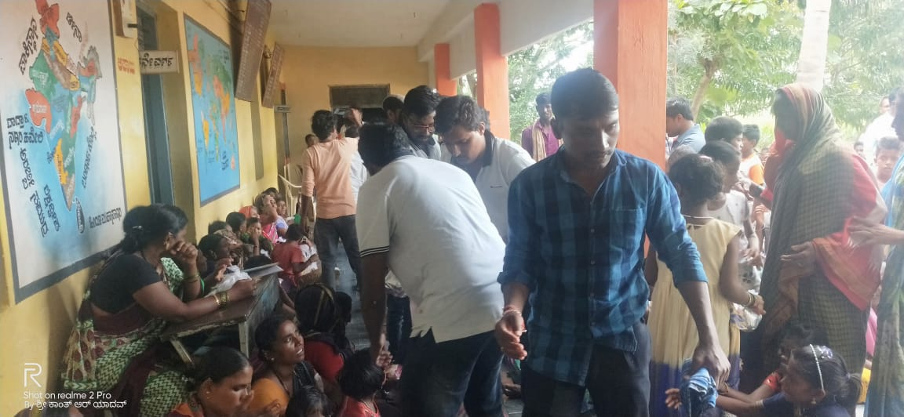

<html>
<head>
<base href="images/" target="_blank">
<title>Shivanandhi(arun Totaganti web site designer) | Volunteering Organisation,</title>
<meta name="keywords" content="Shivanandhi, NGO, Youth Organisation,gajendragad">
						<meta name="viewport" content="width=device-width,initial-scale=1,user-scalable=no">
<meta content="text/html; charset=iso-8859-2" http-equiv="Content-Type">
<link rel="stylesheet" type="text/css" href="main.css">
<link rel="stylesheet" href="https://www.w3schools.com/w3css/4/w3.css">
<link href="https://fonts.googleapis.com/css?family=Open+Sans" rel="stylesheet">

</head>

<body style="background-color:#f0e3ff;">

  <a href="javascript:void(0)" class="closebtn" onclick="closeNav()">&times;</a>
  <a href="#">About us </a>
  <a href="#">Services</a>
  <a href="#">Achivements</a>
  <a href="#">Contact</a>

  

      

	&#9776; open 
      
<strong>Shivanandhi NGO group,Gajendragad</strong>

      

    

      
      
      
 
 
 
  <h3 align="center"><strong>WHO ARE WE?</strong></h3>
  
Shivanandi is one of India largest independent youth volunteer non-profit organisations.

<cite>Shivanandi,</cite> as a platform,In India for causes like education, environment, animals and community welfare.

  <table align="center">
  <tr>
  <td><h3 style="color:blue">Group members</h3></td>
  <td><h3 style="color:blue">contact details</h3></td>
  </tr>
  <tr>
  <td>Arunkumar Totaganti</td>
  <td>8792771726</td>
  </tr>
	<tr>
  <td>Akshay Patted</td>
  <td>9480599375</td>
  </tr>
  <tr>
  <td>Bharath Noolvi</td>
  <td>8892720565</td>
  </tr>
  <tr>
  <td>Kantu</td>
  <td>8970188045</td>
  </tr>
  <tr>
  <td> kiran</td>
  <td>9964113780</td>
  </tr>
  
  <tr>
  <td> Shashi</td>
  <td>9880132016</td>
  </tr>
	<tr>
  <td> Faruk</td>
  <td>7846947443</td>
  </tr>
  
  </table>

  

  

</body>

</html>
